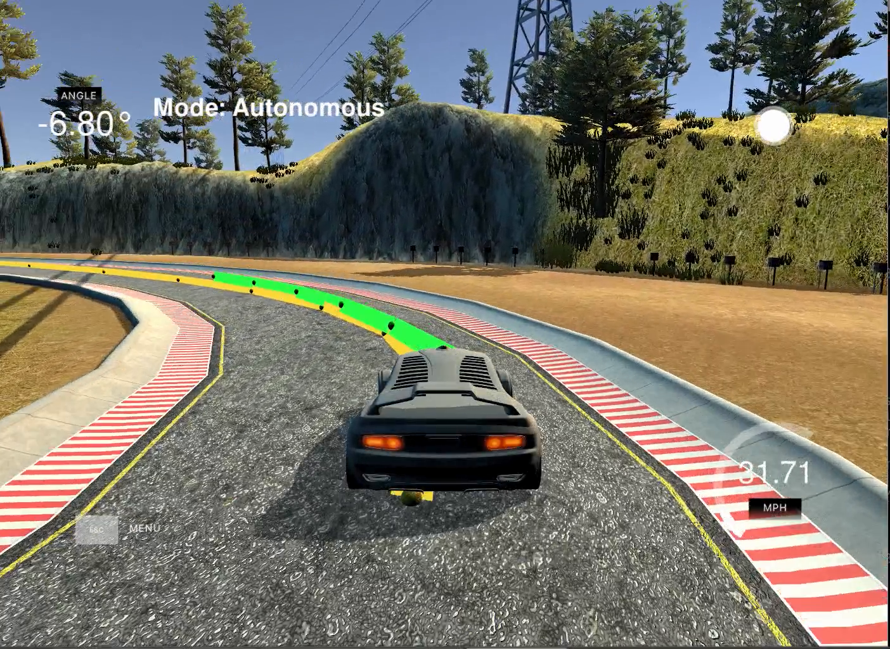

# CarND-Controls-MPC
Self-Driving Car Engineer Nanodegree Program


---
The MPC controller drives the vehicle given a reference track around the simulated environment provided bu Udacity Simulator.



Demo : [MPC_controller](https://youtu.be/VtINpEImMoc)

#Model
There are 3 main component:

	I) The Model state:

		1. Px : x-position of vehicle
		2. Py : y-position of vehicle
		3. Psi: Orientation of the vehicle
		4. v  : velocity of the vehicle.

	II) Actuators:
		
		1. deltaPsi : Sterring angle
		2. a        : acceleration

	III)Update Equation for the model
		
		1. x(t+1)   = x(t) + v(t)*cos(psi)*dt
		2. y(t+1)   = y(t) + v(t)*sin(psi)*dt
		3. psi(t+1) = psi(t) + (v(t) / Lf)*deltaPsi*dt
		4. v(t+1)   = v(t) + a*dt
		**Lf is the distance between the front axle and center of gravity of the vehicle

#Timesteps 

	Timesteps N : 15

	Duration dt : 0.12

#Cost functions:
	
	1. Cross track Error (CTE) (coeff: 2000)
	
	2. Orientation Error       (coeff: 1700)
	
	3. Reference Velocity      (coeff: 1.0)
	
	4. Steering actuator       (coeff: 15000)
	
	5. Acceleration actuator   (coeff: 1.0)
	
	6. Sequential action diff for steering  (coeff : 2.0)
	
	7. Sequential action diff for acceleration.


#Latency: 

There was a latency of 0.1 seconds between the controller and the actuations. This affected the performance at sharp turns and oscillations were amplified. The solution for this is to increase the timsteps to look ahead the track and also increase the cost of steering actuators and keep the vehicle at safe speed.
		
## Dependencies

* cmake >= 3.5
 * All OSes: [click here for installation instructions](https://cmake.org/install/)
* make >= 4.1(mac, linux), 3.81(Windows)
  * Linux: make is installed by default on most Linux distros
  * Mac: [install Xcode command line tools to get make](https://developer.apple.com/xcode/features/)
  * Windows: [Click here for installation instructions](http://gnuwin32.sourceforge.net/packages/make.htm)
* gcc/g++ >= 5.4
  * Linux: gcc / g++ is installed by default on most Linux distros
  * Mac: same deal as make - [install Xcode command line tools]((https://developer.apple.com/xcode/features/)
  * Windows: recommend using [MinGW](http://www.mingw.org/)
* [uWebSockets](https://github.com/uWebSockets/uWebSockets)
  * Run either `install-mac.sh` or `install-ubuntu.sh`.
  * If you install from source, checkout to commit `e94b6e1`, i.e.
    ```
    git clone https://github.com/uWebSockets/uWebSockets
    cd uWebSockets
    git checkout e94b6e1
    ```
    Some function signatures have changed in v0.14.x. See [this PR](https://github.com/udacity/CarND-MPC-Project/pull/3) for more details.

* **Ipopt and CppAD:** Please refer to [this document](https://github.com/udacity/CarND-MPC-Project/blob/master/install_Ipopt_CppAD.md) for installation instructions.
* [Eigen](http://eigen.tuxfamily.org/index.php?title=Main_Page). This is already part of the repo so you shouldn't have to worry about it.
* Simulator. You can download these from the [releases tab](https://github.com/udacity/self-driving-car-sim/releases).
* Not a dependency but read the [DATA.md](./DATA.md) for a description of the data sent back from the simulator.


## Basic Build Instructions

1. Clone this repo.
2. Make a build directory: `mkdir build && cd build`
3. Compile: `cmake .. && make`
4. Run it: `./mpc`.

